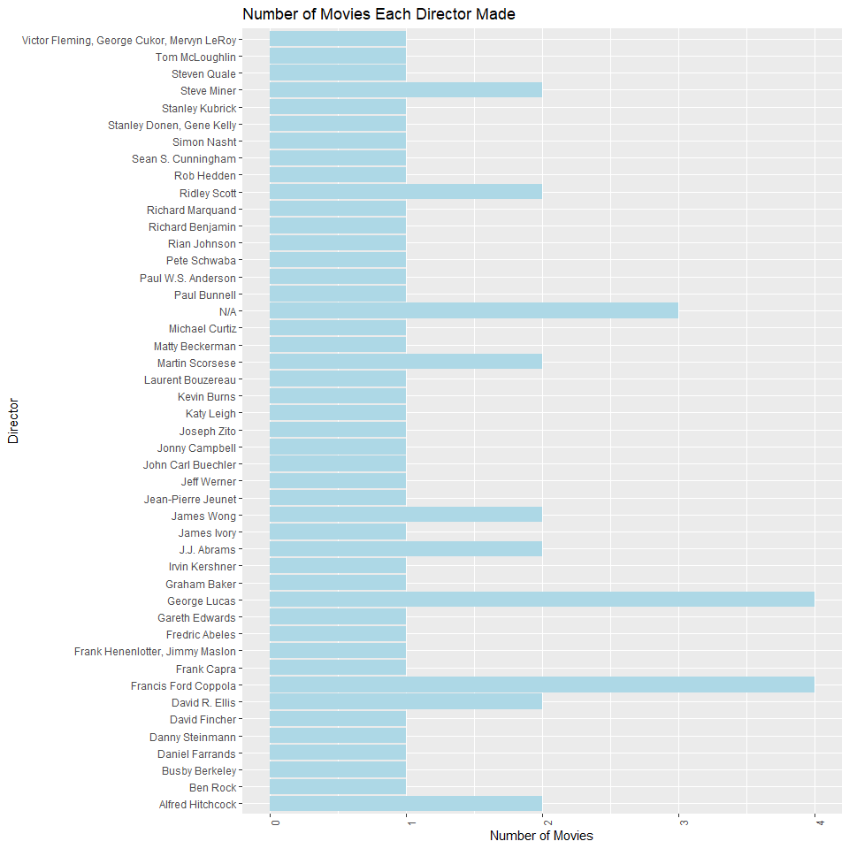
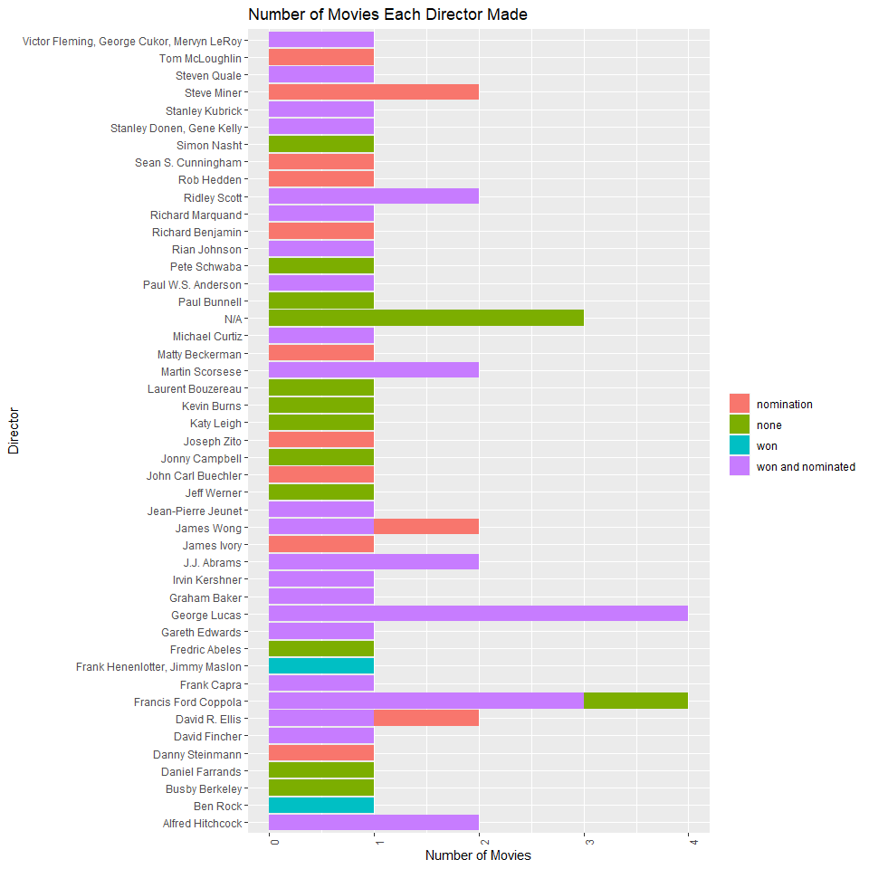
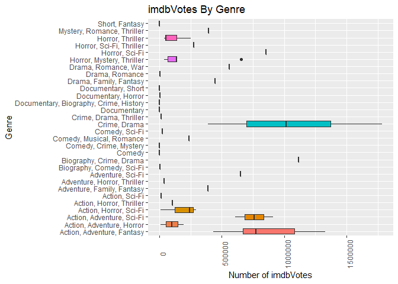
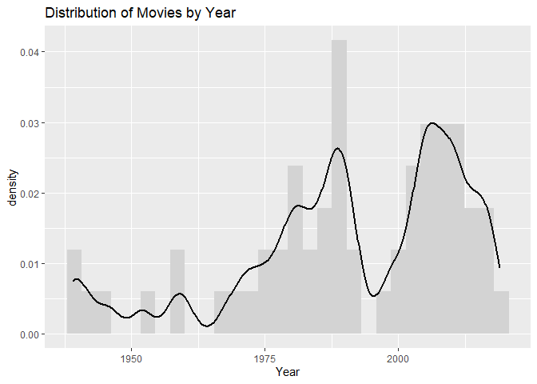

Project 1
================

-   [Lets Get Started: OMDb API Key](#lets-get-started-omdb-api-key)
-   [Build URL for One Movie Title](#build-url-for-one-movie-title)
-   [Build URL for One Movie Title and One
    Date](#build-url-for-one-movie-title-and-one-date)
-   [Build URL for One IMDb ID](#build-url-for-one-imdb-id)
-   [Build URL to Search for Movies in a
    Series](#build-url-to-search-for-movies-in-a-series)
-   [Build URL to Search for One or More Titles or
    Series](#build-url-to-search-for-one-or-more-titles-or-series)
-   [Get the Data for One Series](#get-the-data-for-one-series)
-   [Get the Data for One or More
    Series](#get-the-data-for-one-or-more-series)
-   [Let’s make a data set!](#lets-make-a-data-set)
-   [Exploratory Data Analysis](#exploratory-data-analysis)
    -   [Contingency Tables](#contingency-tables)
    -   [Bar Plots](#bar-plots)
    -   [Measures of Center and Spread (Box Plot and
        Histogram)](#measures-of-center-and-spread-box-plot-and-histogram)
    -   [Covariance and Correlation](#covariance-and-correlation)
    -   [Scatterplot](#scatterplot)

# Lets Get Started: OMDb API Key

In order to access the OMDb API, you need to get a free [api
key](http://www.omdbapi.com/apikey.aspx). In the rest of this document,
“mykey” refers to your OMDb API key.

You should also “turn on” these packages by running the code below. If
you don’t have them installed yet, run `install.packages()` with the
package in quotes. For example, to install `tidyverse`, you would run
`install.packages("tidyverse")`.

``` r
library(httr) #this package will help use use the URL we built to get information from the OMDb API
library(jsonlite) #this package will help us convert the data we get from the OMDb API to a more usable format
library(tidyverse) #this package will help us work with our nicely formatted data.
library(lubridate) #this package will help us create dates 
library(ggplot2) #this package will help us make graphs
```

In order to get information from the OMDb API, we have to build a URL
with our search criteria. It’s similar to doing a Google search. There
are two ways to build a URL: “By ID or Title” or “By Search”.

# Build URL for One Movie Title

Let’s say you have a movie title in mind, like Star Wars (1977). Here’s
a function you can use to get data from the OMDb API about Star Wars
(1977):

Note: the parameter “type” has three options: movie, series, and
episode. If “type” is not specified, it will give everything (including
movies, series, and episodes). I’m making the default for “type” be
“movie”, but you can change this if you want.

``` r
search_by_title <- function(mykey,title,type="movie"){
  base_url <- paste0("http://www.omdbapi.com/?apikey=",mykey)
  info_url <- paste0("&t=",title,"&type=",type) 
  full_url <- paste0(base_url, info_url)
  full_url <- gsub(full_url, pattern = " ", replacement = "%20")
  
  movie_api_call <- GET(full_url)
  movie_api_call_char <- rawToChar(movie_api_call$content)
  movie_JSON <- jsonlite::fromJSON(movie_api_call_char, flatten = TRUE) 
  movie_JSON <- as.data.frame(movie_JSON)
  tibble_movie_JSON <- as_tibble(movie_JSON)
  return(tibble_movie_JSON)
}
```

You should run the function like this:

``` r
search_by_title("mykey","star_wars",type="movie")
```

You should get a tibble that looks like this:

    ## # A tibble: 3 × 26
    ##   Title     Year  Rated Released  Runtime Genre Director Writer Actors Plot  Language Country Awards Poster Ratings.Source
    ##   <chr>     <chr> <chr> <chr>     <chr>   <chr> <chr>    <chr>  <chr>  <chr> <chr>    <chr>   <chr>  <chr>  <chr>         
    ## 1 Star Wars 1977  PG    25 May 1… 121 min Acti… George … Georg… Mark … Luke… English  United… Won 6… https… Internet Movi…
    ## 2 Star Wars 1977  PG    25 May 1… 121 min Acti… George … Georg… Mark … Luke… English  United… Won 6… https… Rotten Tomato…
    ## 3 Star Wars 1977  PG    25 May 1… 121 min Acti… George … Georg… Mark … Luke… English  United… Won 6… https… Metacritic    
    ## # … with 11 more variables: Ratings.Value <chr>, Metascore <chr>, imdbRating <chr>, imdbVotes <chr>, imdbID <chr>,
    ## #   Type <chr>, DVD <chr>, BoxOffice <chr>, Production <chr>, Website <chr>, Response <chr>

# Build URL for One Movie Title and One Date

If you don’t specify a date, the OMDb API will give the first result.
So, since Star Wars (1977) was the first Star Wars movie ever made, it
gives Star Wars (1977) as the result. But, what if you wanted a
different Star Wars movie like Star Wars: Episode VII - The Force
Awakens (2015)? You can use this funciton:

``` r
search_by_title_and_date <- function(mykey,title,type="movie",date){
  base_url <- paste0("http://www.omdbapi.com/?apikey=",mykey)
  info_url <- paste0("&t=",title,"&type=",type,"&y=",date) 
  full_url <- paste0(base_url, info_url)
  full_url <- gsub(full_url, pattern = " ", replacement = "%20")
  
  movie_api_call <- GET(full_url)
  movie_api_call_char <- rawToChar(movie_api_call$content)
  movie_JSON <- jsonlite::fromJSON(movie_api_call_char, flatten = TRUE) 
  movie_JSON <- as.data.frame(movie_JSON)
  tibble_movie_JSON <- as_tibble(movie_JSON)
  return(tibble_movie_JSON)
}
```

You should run the function like this:

``` r
search_by_title_and_date("mykey","star_wars",type="movie",date=2015)
```

Get a tibble like this:

    ## # A tibble: 3 × 26
    ##   Title      Year  Rated Released Runtime Genre Director Writer Actors Plot  Language Country Awards Poster Ratings.Source
    ##   <chr>      <chr> <chr> <chr>    <chr>   <chr> <chr>    <chr>  <chr>  <chr> <chr>    <chr>   <chr>  <chr>  <chr>         
    ## 1 Star Wars… 2015  PG-13 18 Dec … 138 min Acti… J.J. Ab… Lawre… Daisy… As a… English  United… Nomin… https… Internet Movi…
    ## 2 Star Wars… 2015  PG-13 18 Dec … 138 min Acti… J.J. Ab… Lawre… Daisy… As a… English  United… Nomin… https… Rotten Tomato…
    ## 3 Star Wars… 2015  PG-13 18 Dec … 138 min Acti… J.J. Ab… Lawre… Daisy… As a… English  United… Nomin… https… Metacritic    
    ## # … with 11 more variables: Ratings.Value <chr>, Metascore <chr>, imdbRating <chr>, imdbVotes <chr>, imdbID <chr>,
    ## #   Type <chr>, DVD <chr>, BoxOffice <chr>, Production <chr>, Website <chr>, Response <chr>

# Build URL for One IMDb ID

Lets say you have a valid IMDb ID. You can find an IMDb ID by searching
for a title on the [IMDb website](www.imdb.com). After you find a movie
you like, the IMDb ID will be in the URL. For example, the URL for the
IMDb page for Star Wars: Episode V - The Empire Strikes Back (1980) is
<https://www.imdb.com/title/tt0080684/?ref_=nv_sr_srsg_0>. Therefore,
its IMDb ID is tt0080684.

Here’s a function you can use if you have a valid IMDb ID:

``` r
search_by_IMDb_ID <- function(mykey,IMDb_ID,type="movie"){
  base_url <- paste0("http://www.omdbapi.com/?apikey=",mykey)
  info_url <- paste0("&i=",IMDb_ID,"&type=",type) 
  full_url <- paste0(base_url, info_url)
  full_url <- gsub(full_url, pattern = " ", replacement = "%20")
  
  movie_api_call <- GET(full_url)
  movie_api_call_char <- rawToChar(movie_api_call$content)
  movie_JSON <- jsonlite::fromJSON(movie_api_call_char, flatten = TRUE) 
  movie_JSON <- as.data.frame(movie_JSON)
  tibble_movie_JSON <- as_tibble(movie_JSON)
  return(tibble_movie_JSON)
}
```

You should run the function like this:

``` r
search_by_IMDb_ID("mykey","tt0080684",type="movie")
```

You should get a tibble that looks like this:

    ## # A tibble: 3 × 26
    ##   Title      Year  Rated Released Runtime Genre Director Writer Actors Plot  Language Country Awards Poster Ratings.Source
    ##   <chr>      <chr> <chr> <chr>    <chr>   <chr> <chr>    <chr>  <chr>  <chr> <chr>    <chr>   <chr>  <chr>  <chr>         
    ## 1 Star Wars… 1980  PG    20 Jun … 124 min Acti… Irvin K… Leigh… Mark … Afte… English  United… Won 1… https… Internet Movi…
    ## 2 Star Wars… 1980  PG    20 Jun … 124 min Acti… Irvin K… Leigh… Mark … Afte… English  United… Won 1… https… Rotten Tomato…
    ## 3 Star Wars… 1980  PG    20 Jun … 124 min Acti… Irvin K… Leigh… Mark … Afte… English  United… Won 1… https… Metacritic    
    ## # … with 11 more variables: Ratings.Value <chr>, Metascore <chr>, imdbRating <chr>, imdbVotes <chr>, imdbID <chr>,
    ## #   Type <chr>, DVD <chr>, BoxOffice <chr>, Production <chr>, Website <chr>, Response <chr>

# Build URL to Search for Movies in a Series

Let’s say you wanted to get all of the titles for all of the Star Wars
movies. You would then need to build your URL “By Search” instead.
Here’s a function you can use if you wanted to search for multiple movie
titles:

``` r
by_search_series <- function(mykey,title,type="movie"){
  base_url <- paste0("http://www.omdbapi.com/?apikey=",mykey)
  info_url <- paste0("&s=",title,"&type=",type) 
  full_url <- paste0(base_url, info_url)
  full_url <- gsub(full_url, pattern = " ", replacement = "%20")
  
  movie_api_call <- GET(full_url)
  movie_api_call_char <- rawToChar(movie_api_call$content)
  movie_JSON <- jsonlite::fromJSON(movie_api_call_char, flatten = TRUE) 
  movie_JSON <- as.data.frame(movie_JSON)
  tibble_movie_JSON <- as_tibble(movie_JSON)
  return(tibble_movie_JSON)
}
```

You should run the function like this:

``` r
by_search_series("mykey","star_wars",type="movie")
```

You should get a tibble that looks like this:

    ## # A tibble: 10 × 7
    ##    Search.Title                                  Search.Year Search.imdbID Search.Type Search.Poster totalResults Response
    ##    <chr>                                         <chr>       <chr>         <chr>       <chr>         <chr>        <chr>   
    ##  1 Star Wars                                     1977        tt0076759     movie       https://m.me… 539          True    
    ##  2 Star Wars: Episode V - The Empire Strikes Ba… 1980        tt0080684     movie       https://m.me… 539          True    
    ##  3 Star Wars: Episode VI - Return of the Jedi    1983        tt0086190     movie       https://m.me… 539          True    
    ##  4 Star Wars: Episode VII - The Force Awakens    2015        tt2488496     movie       https://m.me… 539          True    
    ##  5 Star Wars: Episode I - The Phantom Menace     1999        tt0120915     movie       https://m.me… 539          True    
    ##  6 Star Wars: Episode III - Revenge of the Sith  2005        tt0121766     movie       https://m.me… 539          True    
    ##  7 Star Wars: Episode II - Attack of the Clones  2002        tt0121765     movie       https://m.me… 539          True    
    ##  8 Star Wars: Episode VIII - The Last Jedi       2017        tt2527336     movie       https://m.me… 539          True    
    ##  9 Rogue One: A Star Wars Story                  2016        tt3748528     movie       https://m.me… 539          True    
    ## 10 Star Wars: Episode IX - The Rise of Skywalker 2019        tt2527338     movie       https://m.me… 539          True

# Build URL to Search for One or More Titles or Series

Now, what if you want to get all of the data for all of the Star Wars
movies and all of the Indiana Jones movies. The function below can
handle a list of several titles or one title.

``` r
mat=NULL
by_search_one_or_more_titles <- function(mykey,title,type="movie"){
 if(length(title)<=1){ 
  base_url <- paste0("http://www.omdbapi.com/?apikey=",mykey)
    info_url <- paste0("&s=",title,"&type=",type) 
    full_url <- paste0(base_url, info_url)
    full_url <- gsub(full_url, pattern = " ", replacement = "%20")
    
    movie_api_call <- GET(full_url)
    movie_api_call_char <- rawToChar(movie_api_call$content)
    movie_JSON <- jsonlite::fromJSON(movie_api_call_char, flatten = TRUE) 
    movie_JSON <- as.data.frame(movie_JSON)
    movie_JSON <- as_tibble(movie_JSON)
    return(movie_JSON)
 }
  if(length(title)>1){
  for(i in title){
  base_url <- paste0("http://www.omdbapi.com/?apikey=",mykey)
  info_url <- paste0("&s=",i,"&type=",type) 
  full_url <- paste0(base_url, info_url)
  full_url <- gsub(full_url, pattern = " ", replacement = "%20")
  
  movie_api_call <- GET(full_url)
  movie_api_call_char <- rawToChar(movie_api_call$content)
  movie_JSON <- jsonlite::fromJSON(movie_api_call_char, flatten = TRUE) 
  movie_JSON <- as.data.frame(movie_JSON)
  mat=rbind(mat,movie_JSON)
  mat=as_tibble(mat)
  }
    }
  return(mat)
}
```

You should run the function like this:

``` r
by_search_one_or_more_titles("mykey",c("star_wars","indiana_jones"),type="movie")
```

You would get the tibble below:

    ## # A tibble: 20 × 7
    ##    Search.Title                                  Search.Year Search.imdbID Search.Type Search.Poster totalResults Response
    ##    <chr>                                         <chr>       <chr>         <chr>       <chr>         <chr>        <chr>   
    ##  1 Star Wars                                     1977        tt0076759     movie       https://m.me… 539          True    
    ##  2 Star Wars: Episode V - The Empire Strikes Ba… 1980        tt0080684     movie       https://m.me… 539          True    
    ##  3 Star Wars: Episode VI - Return of the Jedi    1983        tt0086190     movie       https://m.me… 539          True    
    ##  4 Star Wars: Episode VII - The Force Awakens    2015        tt2488496     movie       https://m.me… 539          True    
    ##  5 Star Wars: Episode I - The Phantom Menace     1999        tt0120915     movie       https://m.me… 539          True    
    ##  6 Star Wars: Episode III - Revenge of the Sith  2005        tt0121766     movie       https://m.me… 539          True    
    ##  7 Star Wars: Episode II - Attack of the Clones  2002        tt0121765     movie       https://m.me… 539          True    
    ##  8 Star Wars: Episode VIII - The Last Jedi       2017        tt2527336     movie       https://m.me… 539          True    
    ##  9 Rogue One: A Star Wars Story                  2016        tt3748528     movie       https://m.me… 539          True    
    ## 10 Star Wars: Episode IX - The Rise of Skywalker 2019        tt2527338     movie       https://m.me… 539          True    
    ## 11 Indiana Jones and the Raiders of the Lost Ark 1981        tt0082971     movie       https://m.me… 83           True    
    ## 12 Indiana Jones and the Last Crusade            1989        tt0097576     movie       https://m.me… 83           True    
    ## 13 Indiana Jones and the Temple of Doom          1984        tt0087469     movie       https://m.me… 83           True    
    ## 14 Indiana Jones and the Kingdom of the Crystal… 2008        tt0367882     movie       https://m.me… 83           True    
    ## 15 Indiana Jones and the Temple of the Forbidde… 1995        tt0764648     movie       https://m.me… 83           True    
    ## 16 The Adventures of Young Indiana Jones: Treas… 1995        tt0115031     movie       https://m.me… 83           True    
    ## 17 The Adventures of Young Indiana Jones: Trave… 1996        tt0154003     movie       https://m.me… 83           True    
    ## 18 The Adventures of Young Indiana Jones: Attac… 1995        tt0154004     movie       https://m.me… 83           True    
    ## 19 Mr. Plinkett's Indiana Jones and the Kingdom… 2011        tt6330122     movie       https://m.me… 83           True    
    ## 20 The Adventures of Young Indiana Jones: Holly… 1994        tt0111806     movie       https://m.me… 83           True

If you wanted to search for one title or series, like Indiana Jones, you
would run the function like this:

``` r
by_search_one_or_more_titles("mykey","indiana_jones",type="movie")
```

You would get this tibble:

    ## # A tibble: 10 × 7
    ##    Search.Title                                  Search.Year Search.imdbID Search.Type Search.Poster totalResults Response
    ##    <chr>                                         <chr>       <chr>         <chr>       <chr>         <chr>        <chr>   
    ##  1 Indiana Jones and the Raiders of the Lost Ark 1981        tt0082971     movie       https://m.me… 83           True    
    ##  2 Indiana Jones and the Last Crusade            1989        tt0097576     movie       https://m.me… 83           True    
    ##  3 Indiana Jones and the Temple of Doom          1984        tt0087469     movie       https://m.me… 83           True    
    ##  4 Indiana Jones and the Kingdom of the Crystal… 2008        tt0367882     movie       https://m.me… 83           True    
    ##  5 Indiana Jones and the Temple of the Forbidde… 1995        tt0764648     movie       https://m.me… 83           True    
    ##  6 The Adventures of Young Indiana Jones: Treas… 1995        tt0115031     movie       https://m.me… 83           True    
    ##  7 The Adventures of Young Indiana Jones: Trave… 1996        tt0154003     movie       https://m.me… 83           True    
    ##  8 The Adventures of Young Indiana Jones: Attac… 1995        tt0154004     movie       https://m.me… 83           True    
    ##  9 Mr. Plinkett's Indiana Jones and the Kingdom… 2011        tt6330122     movie       https://m.me… 83           True    
    ## 10 The Adventures of Young Indiana Jones: Holly… 1994        tt0111806     movie       https://m.me… 83           True

# Get the Data for One Series

That’s great! Now, lets get the data for all of the Star Wars movies:

``` r
mat=NULL
get_data_series <- function(mykey,title){
  temp_table <- by_search_series(mykey,title,type="movie")
  list_of_titles <- unique(temp_table$Search.Title)
  
  for(movie_title in list_of_titles){
  table <- search_by_title(mykey,movie_title,type="movie")
  mat=rbind(mat,table)
  }
  return(mat)
}
```

You should run the function like this:

``` r
get_data_series("mykey","star_wars")
```

You should get a tibble that looks like this:

    ## # A tibble: 30 × 26
    ##    Title     Year  Rated Released Runtime Genre Director Writer Actors Plot  Language Country Awards Poster Ratings.Source
    ##    <chr>     <chr> <chr> <chr>    <chr>   <chr> <chr>    <chr>  <chr>  <chr> <chr>    <chr>   <chr>  <chr>  <chr>         
    ##  1 Star Wars 1977  PG    25 May … 121 min Acti… George … Georg… Mark … Luke… English  United… Won 6… https… Internet Movi…
    ##  2 Star Wars 1977  PG    25 May … 121 min Acti… George … Georg… Mark … Luke… English  United… Won 6… https… Rotten Tomato…
    ##  3 Star Wars 1977  PG    25 May … 121 min Acti… George … Georg… Mark … Luke… English  United… Won 6… https… Metacritic    
    ##  4 Star War… 1980  PG    20 Jun … 124 min Acti… Irvin K… Leigh… Mark … Afte… English  United… Won 1… https… Internet Movi…
    ##  5 Star War… 1980  PG    20 Jun … 124 min Acti… Irvin K… Leigh… Mark … Afte… English  United… Won 1… https… Rotten Tomato…
    ##  6 Star War… 1980  PG    20 Jun … 124 min Acti… Irvin K… Leigh… Mark … Afte… English  United… Won 1… https… Metacritic    
    ##  7 Star War… 1983  PG    25 May … 131 min Acti… Richard… Lawre… Mark … Afte… English  United… Nomin… https… Internet Movi…
    ##  8 Star War… 1983  PG    25 May … 131 min Acti… Richard… Lawre… Mark … Afte… English  United… Nomin… https… Rotten Tomato…
    ##  9 Star War… 1983  PG    25 May … 131 min Acti… Richard… Lawre… Mark … Afte… English  United… Nomin… https… Metacritic    
    ## 10 Star War… 2015  PG-13 18 Dec … 138 min Acti… J.J. Ab… Lawre… Daisy… As a… English  United… Nomin… https… Internet Movi…
    ## # … with 20 more rows, and 11 more variables: Ratings.Value <chr>, Metascore <chr>, imdbRating <chr>, imdbVotes <chr>,
    ## #   imdbID <chr>, Type <chr>, DVD <chr>, BoxOffice <chr>, Production <chr>, Website <chr>, Response <chr>

# Get the Data for One or More Series

Now, lets get all of the data for both Star Wars and Indiana Jones:

``` r
mat=NULL
get_data_one_or_more_titles <- function(mykey,title){
  temp_table <- by_search_one_or_more_titles(mykey,title,type="movie")
  list_of_titles <- unique(temp_table$Search.Title)
  
  for(movie_title in list_of_titles){
  table <- search_by_title(mykey,movie_title,type="movie")
  mat=rbind(mat,table)
  }
  return(mat)
}
```

You would run the function like this:

``` r
get_data_one_or_more_titles("mykey",c("star_wars","indiana_jones"))
```

    ## # A tibble: 48 × 26
    ##    Title     Year  Rated Released Runtime Genre Director Writer Actors Plot  Language Country Awards Poster Ratings.Source
    ##    <chr>     <chr> <chr> <chr>    <chr>   <chr> <chr>    <chr>  <chr>  <chr> <chr>    <chr>   <chr>  <chr>  <chr>         
    ##  1 Star Wars 1977  PG    25 May … 121 min Acti… George … Georg… Mark … Luke… English  United… Won 6… https… Internet Movi…
    ##  2 Star Wars 1977  PG    25 May … 121 min Acti… George … Georg… Mark … Luke… English  United… Won 6… https… Rotten Tomato…
    ##  3 Star Wars 1977  PG    25 May … 121 min Acti… George … Georg… Mark … Luke… English  United… Won 6… https… Metacritic    
    ##  4 Star War… 1980  PG    20 Jun … 124 min Acti… Irvin K… Leigh… Mark … Afte… English  United… Won 1… https… Internet Movi…
    ##  5 Star War… 1980  PG    20 Jun … 124 min Acti… Irvin K… Leigh… Mark … Afte… English  United… Won 1… https… Rotten Tomato…
    ##  6 Star War… 1980  PG    20 Jun … 124 min Acti… Irvin K… Leigh… Mark … Afte… English  United… Won 1… https… Metacritic    
    ##  7 Star War… 1983  PG    25 May … 131 min Acti… Richard… Lawre… Mark … Afte… English  United… Nomin… https… Internet Movi…
    ##  8 Star War… 1983  PG    25 May … 131 min Acti… Richard… Lawre… Mark … Afte… English  United… Nomin… https… Rotten Tomato…
    ##  9 Star War… 1983  PG    25 May … 131 min Acti… Richard… Lawre… Mark … Afte… English  United… Nomin… https… Metacritic    
    ## 10 Star War… 2015  PG-13 18 Dec … 138 min Acti… J.J. Ab… Lawre… Daisy… As a… English  United… Nomin… https… Internet Movi…
    ## # … with 38 more rows, and 11 more variables: Ratings.Value <chr>, Metascore <chr>, imdbRating <chr>, imdbVotes <chr>,
    ## #   imdbID <chr>, Type <chr>, DVD <chr>, BoxOffice <chr>, Production <chr>, Website <chr>, Response <chr>

# Let’s make a data set!

First, I’m going to make two lists of movies:

``` r
#for these movies, I just want the first result it gives me because they are not a series:
titles <- c("casablanca",
            "the_wizard_of_oz",
            "it's_a_wonderful_life",
            "goodfellas",
            "taxi_driver",
            "psycho",
            "singin_in_the_rain",
            "2001:_a_space_odyssey",
            "vertigo")

#for these movies, I want all of them in each series:
series <- c("the_godfather",
            "star_wars",
            "alien",
            "fast_and_furious",
            "final_destination",
            "friday_the_13th")
```

Here is the function I’m going to use to get all of the data for all of
my movies:

``` r
mat1=NULL
mat2=NULL
mat3=NULL
get_data_titles_and_series <- function(mykey,titles,series){
  for(i in titles){
    temp_table <- search_by_title(mykey,i,type="movie")
      mat1=rbind(mat1,temp_table)
  }
  for(j in series){
    temp_table <- by_search_series(mykey,j,type="movie")
    list_of_titles <- unique(temp_table$Search.Title)
    for(movie_title in list_of_titles){
      table2 <- search_by_title(mykey,movie_title,type="movie")
      mat2=rbind(mat2,table2)
    }
  }
  mat3=rbind(mat3,mat1,mat2)
  return(mat3)
}
```

I’m going to run the function like this:

``` r
get_data_titles_and_series("mykey",titles,series)
```

Here is the tibble I get:

    ## # A tibble: 152 × 26
    ##    Title     Year  Rated Released Runtime Genre Director Writer Actors Plot  Language Country Awards Poster Ratings.Source
    ##    <chr>     <chr> <chr> <chr>    <chr>   <chr> <chr>    <chr>  <chr>  <chr> <chr>    <chr>   <chr>  <chr>  <chr>         
    ##  1 Casablan… 1942  PG    23 Jan … 102 min Dram… Michael… Juliu… Humph… A cy… English… United… Won 3… https… Internet Movi…
    ##  2 Casablan… 1942  PG    23 Jan … 102 min Dram… Michael… Juliu… Humph… A cy… English… United… Won 3… https… Rotten Tomato…
    ##  3 Casablan… 1942  PG    23 Jan … 102 min Dram… Michael… Juliu… Humph… A cy… English… United… Won 3… https… Metacritic    
    ##  4 The Wiza… 1939  G     25 Aug … 102 min Adve… Victor … Noel … Judy … Youn… English  United… Won 2… https… Internet Movi…
    ##  5 The Wiza… 1939  G     25 Aug … 102 min Adve… Victor … Noel … Judy … Youn… English  United… Won 2… https… Rotten Tomato…
    ##  6 The Wiza… 1939  G     25 Aug … 102 min Adve… Victor … Noel … Judy … Youn… English  United… Won 2… https… Metacritic    
    ##  7 It's a W… 1946  PG    07 Jan … 130 min Dram… Frank C… Franc… James… An a… English… United… Nomin… https… Internet Movi…
    ##  8 It's a W… 1946  PG    07 Jan … 130 min Dram… Frank C… Franc… James… An a… English… United… Nomin… https… Rotten Tomato…
    ##  9 It's a W… 1946  PG    07 Jan … 130 min Dram… Frank C… Franc… James… An a… English… United… Nomin… https… Metacritic    
    ## 10 Goodfell… 1990  R     21 Sep … 145 min Biog… Martin … Nicho… Rober… The … English… United… Won 1… https… Internet Movi…
    ## # … with 142 more rows, and 11 more variables: Ratings.Value <chr>, Metascore <chr>, imdbRating <chr>, imdbVotes <chr>,
    ## #   imdbID <chr>, Type <chr>, DVD <chr>, BoxOffice <chr>, Production <chr>, Website <chr>, Response <chr>

Here is a list of the movie titles in my data set:

``` r
length(unique(unformatted_data$Title))
```

    ## [1] 61

There are 61 unique titles.

``` r
unique(unformatted_data$Title)
```

    ##  [1] "Casablanca"                                               
    ##  [2] "The Wizard of Oz"                                         
    ##  [3] "It's a Wonderful Life"                                    
    ##  [4] "Goodfellas"                                               
    ##  [5] "Taxi Driver"                                              
    ##  [6] "Psycho"                                                   
    ##  [7] "Singin' in the Rain"                                      
    ##  [8] "2001: A Space Odyssey"                                    
    ##  [9] "Vertigo"                                                  
    ## [10] "The Godfather"                                            
    ## [11] "The Godfather: Part II"                                   
    ## [12] "The Godfather: Part III"                                  
    ## [13] "The Godfather Trilogy: 1901-1980"                         
    ## [14] "The Godfather Family: A Look Inside"                      
    ## [15] "The Godfather Legacy"                                     
    ## [16] "Herschell Gordon Lewis: The Godfather of Gore"            
    ## [17] "The Godfather of Green Bay"                               
    ## [18] "Paul Mooney: The Godfather of Comedy"                     
    ## [19] "The Godfather: Behind the Scenes"                         
    ## [20] "Star Wars"                                                
    ## [21] "Star Wars: Episode V - The Empire Strikes Back"           
    ## [22] "Star Wars: Episode VI - Return of the Jedi"               
    ## [23] "Star Wars: Episode VII - The Force Awakens"               
    ## [24] "Star Wars: Episode I - The Phantom Menace"                
    ## [25] "Star Wars: Episode III - Revenge of the Sith"             
    ## [26] "Star Wars: Episode II - Attack of the Clones"             
    ## [27] "Star Wars: Episode VIII - The Last Jedi"                  
    ## [28] "Rogue One: A Star Wars Story"                             
    ## [29] "Star Wars: Episode IX - The Rise of Skywalker"            
    ## [30] "Alien"                                                    
    ## [31] "Alien³"                                                   
    ## [32] "Alien: Covenant"                                          
    ## [33] "Alien: Resurrection"                                      
    ## [34] "Alien vs. Predator"                                       
    ## [35] "My Stepmother Is an Alien"                                
    ## [36] "Alien Nation"                                             
    ## [37] "Alien Raiders"                                            
    ## [38] "Alien Abduction"                                          
    ## [39] "Alien Autopsy"                                            
    ## [40] "Fast and Furious"                                         
    ## [41] "Tasmanian Devil: The Fast and Furious Life of Errol Flynn"
    ## [42] "Christine: Fast and Furious"                              
    ## [43] "Fast and Furious: Fast Cars!"                             
    ## [44] "Final Destination"                                        
    ## [45] "Final Destination 2"                                      
    ## [46] "Final Destination 3"                                      
    ## [47] "Final Destination 5"                                      
    ## [48] "The Final Destination"                                    
    ## [49] "The City of Your Final Destination"                       
    ## [50] "Death's Design: Making 'Final Destination 3'"             
    ## [51] "Final Destination Unknown"                                
    ## [52] "Final Destination 5: Circle of Death"                     
    ## [53] "Friday the 13th"                                          
    ## [54] "Friday the 13th Part 2"                                   
    ## [55] "Friday the 13th Part III"                                 
    ## [56] "Friday the 13th: The Final Chapter"                       
    ## [57] "Friday the 13th Part VI: Jason Lives"                     
    ## [58] "Friday the 13th: A New Beginning"                         
    ## [59] "Friday the 13th Part VIII: Jason Takes Manhattan"         
    ## [60] "Friday the 13th Part VII: The New Blood"                  
    ## [61] "His Name Was Jason: 30 Years of Friday the 13th"

Great, but we can’t use this data until we format it. Here’s what I’m
going to do in the next function:

1.  Convert the following columns from character to numeric:

-   Year
-   Runtime
-   Ratings.Value
-   Metascore
-   imdbRating
-   imdbVotes
-   BoxOffice

2.  Convert the values in these columns to dates (year-month-day):

-   Released
-   DVD

3.  Create two new columns:

-   average_rating is the average of the Ratings.Value, Metascore, and
    imdbRating
-   Summary_Awards shows whether a movie:
    -   won and was nominated for an award
    -   won an award
    -   was nominated for an award
    -   did not win or was not nominated for an award

Here are my helper functions:

``` r
#this will help us convert the Ratings.Value column to numeric
parse_number <- function(S){
  if(grepl("/", S)){
    A<-str_split(S, "/")
    A<-as.numeric(unlist(A))
    A<-A[[1]]/A[[2]]
    A<-A*100
  } else {
    A<-as.numeric(gsub("%","",S))
  }
  return(A)
}

#this will help us make the Awards column more usable
award <- function(S){
  if(is.na(S)){
    A<-"none"
    return(A)
  }
  S=tolower(S)
  #won and nominated:
  if((grepl("won", S) | grepl("win", S)) && (grepl("nomina", S))){
    A<-"won and nominated"
  }
  #only won:
  else if (grepl("won", S) | grepl("win", S)){
    A<-"won"
  }
  #only nominated:
  else if (grepl("nomina", S)){
    A<-"nomination"
  }
  #no awards or nominations:
  else {(A<-"none")
     return(A)
  }
}
```

Here is my complete formatting function:

``` r
mat1=NULL
format_data <- function(mykey,titles,series){
    data <- get_data_titles_and_series(mykey,titles,series)
    data$Year <- as.numeric(data$Year)
    data$Released <- dmy(data$Released)
    data$Runtime <- as.numeric(gsub(" min","",data$Runtime))
    data$Ratings.Value <- sapply(data$Ratings.Value, FUN=parse_number)
    data$Summary_Awards <- as.factor(sapply(data$Awards, FUN=award))
    data$Metascore <- as.numeric(data$Metascore)
    data$imdbRating <- as.numeric(data$imdbRating)*10
    data$imdbVotes <- as.numeric(gsub(",","",data$imdbVotes))
    data$DVD <- dmy(data$DVD)
    data$BoxOffice <- gsub("\\$","",data$BoxOffice)
    data$BoxOffice <- as.numeric(gsub(",","",data$BoxOffice))
    movie_list<-unique(data$Title)
    
    for (i in movie_list){
      temp=data[is.element(data$Title,i),]
      Ratings.Value_mean<-mean(temp$Ratings.Value)
      Metascore<-unique(temp$Metascore)
      imdbRating<-unique(temp$imdbRating)
      
      if(is.na(Metascore)==TRUE){
        temp$average_rating=(Ratings.Value_mean+imdbRating)/2
      }
      if(is.na(Metascore)==FALSE){
        temp$average_rating=(Ratings.Value_mean+Metascore+imdbRating)/3
      }
      mat1=rbind(mat1,temp)
    }
    return(mat1)
}
```

Here’s how I ran it:

``` r
formatted_data<-format_data("mykey",titles,series)
```

Here’s the tibble I got:

    ## # A tibble: 152 × 28
    ##    Title    Year Rated Released   Runtime Genre Director Writer Actors Plot  Language Country Awards Poster Ratings.Source
    ##    <chr>   <dbl> <chr> <date>       <dbl> <chr> <chr>    <chr>  <chr>  <chr> <chr>    <chr>   <chr>  <chr>  <chr>         
    ##  1 Casabl…  1942 PG    1943-01-23     102 Dram… Michael… Juliu… Humph… A cy… English… United… Won 3… https… Internet Movi…
    ##  2 Casabl…  1942 PG    1943-01-23     102 Dram… Michael… Juliu… Humph… A cy… English… United… Won 3… https… Rotten Tomato…
    ##  3 Casabl…  1942 PG    1943-01-23     102 Dram… Michael… Juliu… Humph… A cy… English… United… Won 3… https… Metacritic    
    ##  4 The Wi…  1939 G     1939-08-25     102 Adve… Victor … Noel … Judy … Youn… English  United… Won 2… https… Internet Movi…
    ##  5 The Wi…  1939 G     1939-08-25     102 Adve… Victor … Noel … Judy … Youn… English  United… Won 2… https… Rotten Tomato…
    ##  6 The Wi…  1939 G     1939-08-25     102 Adve… Victor … Noel … Judy … Youn… English  United… Won 2… https… Metacritic    
    ##  7 It's a…  1946 PG    1947-01-07     130 Dram… Frank C… Franc… James… An a… English… United… Nomin… https… Internet Movi…
    ##  8 It's a…  1946 PG    1947-01-07     130 Dram… Frank C… Franc… James… An a… English… United… Nomin… https… Rotten Tomato…
    ##  9 It's a…  1946 PG    1947-01-07     130 Dram… Frank C… Franc… James… An a… English… United… Nomin… https… Metacritic    
    ## 10 Goodfe…  1990 R     1990-09-21     145 Biog… Martin … Nicho… Rober… The … English… United… Won 1… https… Internet Movi…
    ## # … with 142 more rows, and 13 more variables: Ratings.Value <dbl>, Metascore <dbl>, imdbRating <dbl>, imdbVotes <dbl>,
    ## #   imdbID <chr>, Type <chr>, DVD <date>, BoxOffice <dbl>, Production <chr>, Website <chr>, Response <chr>,
    ## #   Summary_Awards <fct>, average_rating <dbl>

When I ran this, I got the following warnings:

`Warning: 2 failed to parse.`

`Warning in format_data("mykey", titles, series): NAs introduced by coercion`

`Warning: 12 failed to parse.`

`Warning in format_data("mykey", titles, series): NAs introduced by coercion`

Let’s see where these warnings are coming from by looking at the
unformatted data:

``` r
test<-unformatted_data[grep("N/A", unformatted_data$Released), ]
test %>%
  select(Released,everything())
```

    ## # A tibble: 2 × 26
    ##   Released Title      Year  Rated Runtime Genre Director Writer Actors Plot  Language Country Awards Poster Ratings.Source
    ##   <chr>    <chr>      <chr> <chr> <chr>   <chr> <chr>    <chr>  <chr>  <chr> <chr>    <chr>   <chr>  <chr>  <chr>         
    ## 1 N/A      The Godfa… 1971  N/A   9 min   Docu… Fredric… N/A    James… N/A   English  United… N/A    N/A    Internet Movi…
    ## 2 N/A      Final Des… 2011  Not … 5 min   Docu… N/A      N/A    Emma … A lo… English  USA     N/A    N/A    Internet Movi…
    ## # … with 11 more variables: Ratings.Value <chr>, Metascore <chr>, imdbRating <chr>, imdbVotes <chr>, imdbID <chr>,
    ## #   Type <chr>, DVD <chr>, BoxOffice <chr>, Production <chr>, Website <chr>, Response <chr>

The first warning (`Warning: 2 failed to parse.`) occurred because the
function `dmy()` from `lubridate` cannot parse the two rows in the
Released column with “N/A” in it (see tibble above). This means that
these two titles do not have a release date, so R puts a `NA` in
instead. They might not have been released to theaters. To remove this
warning, you would need to replace the “N/A” with a date that `dmy()`
can work with.

Let’s look at the second warning (`Warning: 12 failed to parse.`):

``` r
test<-unformatted_data[grep("N/A", unformatted_data$DVD), ]
test %>%
  select(DVD,everything())
```

    ## # A tibble: 12 × 26
    ##    DVD   Title              Year  Rated Released Runtime Genre Director Writer Actors Plot  Language Country Awards Poster
    ##    <chr> <chr>              <chr> <chr> <chr>    <chr>   <chr> <chr>    <chr>  <chr>  <chr> <chr>    <chr>   <chr>  <chr> 
    ##  1 N/A   The Godfather Tri… 1992  R     30 Oct … 583 min Crim… Francis… Franc… Al Pa… The … English… USA     N/A    https…
    ##  2 N/A   The Godfather Fam… 1990  N/A   12 Jul … 73 min  Docu… Jeff We… David… Franc… A do… English… United… N/A    https…
    ##  3 N/A   The Godfather Leg… 2012  TV-14 24 Jul … 95 min  Docu… Kevin B… Kevin… Peter… THE … English  United… N/A    https…
    ##  4 N/A   Paul Mooney: The … 2012  N/A   03 Feb … 86 min  Come… N/A      Paul … Paul … The … English  United… N/A    https…
    ##  5 N/A   The Godfather: Be… 1971  N/A   N/A      9 min   Docu… Fredric… N/A    James… N/A   English  United… N/A    N/A   
    ##  6 N/A   Fast and Furious   1939  Pass… 06 Oct … 73 min  Come… Busby B… Harry… Franc… Rare… English  United… N/A    https…
    ##  7 N/A   Tasmanian Devil: … 2007  N/A   09 Apr … 60 min  Docu… Simon N… Simon… Chris… The … English  Austra… N/A    https…
    ##  8 N/A   Christine: Fast a… 2004  N/A   28 Sep … 29 min  Docu… Laurent… Laure… John … N/A   English  USA     N/A    https…
    ##  9 N/A   Fast and Furious:… 2015  N/A   24 Mar … 40 min  Docu… N/A      N/A    Vin D… Divi… English  USA     N/A    N/A   
    ## 10 N/A   Death's Design: M… 2006  N/A   06 Feb … 15 min  Docu… Katy Le… Carol… Texas… N/A   English  USA     N/A    N/A   
    ## 11 N/A   Final Destination… 1987  N/A   13 Mar … 27 min  Shor… Paul Bu… Paul … Andre… Drif… English  United… N/A    N/A   
    ## 12 N/A   Final Destination… 2011  Not … N/A      5 min   Docu… N/A      N/A    Emma … A lo… English  USA     N/A    N/A   
    ## # … with 11 more variables: Ratings.Source <chr>, Ratings.Value <chr>, Metascore <chr>, imdbRating <chr>,
    ## #   imdbVotes <chr>, imdbID <chr>, Type <chr>, BoxOffice <chr>, Production <chr>, Website <chr>, Response <chr>

Again, the function dmy() cannot parse the twelve rows in the DVD column
with “N/A” in it (see tibble above), so R put in an `NA` for these rows
instead. They might not have been released to DVD. To remove this
warning, you would need to replace the “N/A” with a date that dmy() can
work with.

These warnings will not effect our analysis going forward.

Here is the structure of my formatted data:

``` r
str(formatted_data)
```

    ## tibble [152 × 28] (S3: tbl_df/tbl/data.frame)
    ##  $ Title         : chr [1:152] "Casablanca" "Casablanca" "Casablanca" "The Wizard of Oz" ...
    ##  $ Year          : num [1:152] 1942 1942 1942 1939 1939 ...
    ##  $ Rated         : chr [1:152] "PG" "PG" "PG" "G" ...
    ##  $ Released      : Date[1:152], format: "1943-01-23" "1943-01-23" "1943-01-23" "1939-08-25" ...
    ##  $ Runtime       : num [1:152] 102 102 102 102 102 102 130 130 130 145 ...
    ##  $ Genre         : chr [1:152] "Drama, Romance, War" "Drama, Romance, War" "Drama, Romance, War" "Adventure, Family, Fantasy" ...
    ##  $ Director      : chr [1:152] "Michael Curtiz" "Michael Curtiz" "Michael Curtiz" "Victor Fleming, George Cukor, Mervyn LeRoy" ...
    ##  $ Writer        : chr [1:152] "Julius J. Epstein, Philip G. Epstein, Howard Koch" "Julius J. Epstein, Philip G. Epstein, Howard Koch" "Julius J. Epstein, Philip G. Epstein, Howard Koch" "Noel Langley, Florence Ryerson, Edgar Allan Woolf" ...
    ##  $ Actors        : chr [1:152] "Humphrey Bogart, Ingrid Bergman, Paul Henreid" "Humphrey Bogart, Ingrid Bergman, Paul Henreid" "Humphrey Bogart, Ingrid Bergman, Paul Henreid" "Judy Garland, Frank Morgan, Ray Bolger" ...
    ##  $ Plot          : chr [1:152] "A cynical expatriate American cafe owner struggles to decide whether or not to help his former lover and her fu"| __truncated__ "A cynical expatriate American cafe owner struggles to decide whether or not to help his former lover and her fu"| __truncated__ "A cynical expatriate American cafe owner struggles to decide whether or not to help his former lover and her fu"| __truncated__ "Young Dorothy Gale and her dog are swept away by a tornado from their Kansas farm to the magical Land of Oz, an"| __truncated__ ...
    ##  $ Language      : chr [1:152] "English, French, German, Italian" "English, French, German, Italian" "English, French, German, Italian" "English" ...
    ##  $ Country       : chr [1:152] "United States" "United States" "United States" "United States" ...
    ##  $ Awards        : chr [1:152] "Won 3 Oscars. 10 wins & 9 nominations total" "Won 3 Oscars. 10 wins & 9 nominations total" "Won 3 Oscars. 10 wins & 9 nominations total" "Won 2 Oscars. 13 wins & 16 nominations total" ...
    ##  $ Poster        : chr [1:152] "https://m.media-amazon.com/images/M/MV5BY2IzZGY2YmEtYzljNS00NTM5LTgwMzUtMzM1NjQ4NGI0OTk0XkEyXkFqcGdeQXVyNDYyMDk"| __truncated__ "https://m.media-amazon.com/images/M/MV5BY2IzZGY2YmEtYzljNS00NTM5LTgwMzUtMzM1NjQ4NGI0OTk0XkEyXkFqcGdeQXVyNDYyMDk"| __truncated__ "https://m.media-amazon.com/images/M/MV5BY2IzZGY2YmEtYzljNS00NTM5LTgwMzUtMzM1NjQ4NGI0OTk0XkEyXkFqcGdeQXVyNDYyMDk"| __truncated__ "https://m.media-amazon.com/images/M/MV5BNjUyMTc4MDExMV5BMl5BanBnXkFtZTgwNDg0NDIwMjE@._V1_SX300.jpg" ...
    ##  $ Ratings.Source: chr [1:152] "Internet Movie Database" "Rotten Tomatoes" "Metacritic" "Internet Movie Database" ...
    ##  $ Ratings.Value : Named num [1:152] 85 99 100 81 98 92 86 94 89 87 ...
    ##   ..- attr(*, "names")= chr [1:152] "8.5/10" "99%" "100/100" "8.1/10" ...
    ##  $ Metascore     : num [1:152] 100 100 100 92 92 92 89 89 89 90 ...
    ##  $ imdbRating    : num [1:152] 85 85 85 81 81 81 86 86 86 87 ...
    ##  $ imdbVotes     : num [1:152] 561509 561509 561509 391833 391833 ...
    ##  $ imdbID        : chr [1:152] "tt0034583" "tt0034583" "tt0034583" "tt0032138" ...
    ##  $ Type          : chr [1:152] "movie" "movie" "movie" "movie" ...
    ##  $ DVD           : Date[1:152], format: "1998-11-17" "1998-11-17" "1998-11-17" "2003-08-12" ...
    ##  $ BoxOffice     : num [1:152] 4219709 4219709 4219709 24668669 24668669 ...
    ##  $ Production    : chr [1:152] "N/A" "N/A" "N/A" "N/A" ...
    ##  $ Website       : chr [1:152] "N/A" "N/A" "N/A" "N/A" ...
    ##  $ Response      : chr [1:152] "True" "True" "True" "True" ...
    ##  $ Summary_Awards: Factor w/ 4 levels "nomination","none",..: 4 4 4 4 4 4 4 4 4 4 ...
    ##   ..- attr(*, "names")= chr [1:152] "Won 3 Oscars. 10 wins & 9 nominations total" "Won 3 Oscars. 10 wins & 9 nominations total" "Won 3 Oscars. 10 wins & 9 nominations total" "Won 2 Oscars. 13 wins & 16 nominations total" ...
    ##  $ average_rating: num [1:152] 93.2 93.2 93.2 87.8 87.8 ...

# Exploratory Data Analysis

## Contingency Tables

We can use contingency tables to summarize up to three categorical
variables.

Let’s say I wanted to know how many movies are rated “PG-13” in my data
set. I would make a contingency table summarizing the ratings for all of
the movies:

``` r
A <- formatted_data %>%
  select(Title,Rated)
B<-unique(A)
table(B$Rated)
```

    ## 
    ##         G       N/A Not Rated    Passed        PG     PG-13         R     TV-14 
    ##         3         8         4         1         8         9        27         1

As you can see, 9 out of the 61 movies from my data set are “PG-13”.

Let’s say I wanted to summarize how many movies fell under each genre
listed. I would make the contingency table below:

``` r
C <- formatted_data %>%
  select(Title,Genre)
D<-unique(C)
table(D$Genre)
```

    ## 
    ##             Action, Adventure, Fantasy              Action, Adventure, Horror              Action, Adventure, Sci-Fi 
    ##                                      8                                      2                                      2 
    ##                 Action, Horror, Sci-Fi               Action, Horror, Thriller                         Action, Sci-Fi 
    ##                                      3                                      1                                      1 
    ##             Adventure, Family, Fantasy            Adventure, Horror, Thriller                      Adventure, Sci-Fi 
    ##                                      1                                      1                                      1 
    ##              Biography, Comedy, Sci-Fi                Biography, Crime, Drama                                 Comedy 
    ##                                      1                                      1                                      2 
    ##                 Comedy, Crime, Mystery               Comedy, Musical, Romance                         Comedy, Sci-Fi 
    ##                                      1                                      1                                      1 
    ##                           Crime, Drama                 Crime, Drama, Thriller                            Documentary 
    ##                                      4                                      1                                      3 
    ## Documentary, Biography, Crime, History                    Documentary, Horror                     Documentary, Short 
    ##                                      1                                      1                                      5 
    ##                 Drama, Family, Fantasy                         Drama, Romance                    Drama, Romance, War 
    ##                                      1                                      1                                      1 
    ##              Horror, Mystery, Thriller                         Horror, Sci-Fi               Horror, Sci-Fi, Thriller 
    ##                                      5                                      1                                      1 
    ##                       Horror, Thriller             Mystery, Romance, Thriller                         Short, Fantasy 
    ##                                      7                                      1                                      1

So, for example, it looks like 7 out of the 61 from my data set are
classified under the “Horror, Thriller” genre.

What if we wanted to see both the rating and the genre in the same
table? We could make a two-way contingency table:

``` r
table(B$Rated, D$Genre)
```

    ##            
    ##             Action, Adventure, Fantasy Action, Adventure, Horror Action, Adventure, Sci-Fi Action, Horror, Sci-Fi
    ##   G                                  0                         0                         0                      0
    ##   N/A                                0                         0                         0                      0
    ##   Not Rated                          0                         1                         0                      0
    ##   Passed                             0                         0                         0                      0
    ##   PG                                 5                         0                         0                      0
    ##   PG-13                              3                         1                         2                      0
    ##   R                                  0                         0                         0                      3
    ##   TV-14                              0                         0                         0                      0
    ##            
    ##             Action, Horror, Thriller Action, Sci-Fi Adventure, Family, Fantasy Adventure, Horror, Thriller
    ##   G                                0              0                          1                           0
    ##   N/A                              0              0                          0                           0
    ##   Not Rated                        0              0                          0                           0
    ##   Passed                           0              0                          0                           0
    ##   PG                               0              0                          0                           0
    ##   PG-13                            0              0                          0                           0
    ##   R                                1              1                          0                           1
    ##   TV-14                            0              0                          0                           0
    ##            
    ##             Adventure, Sci-Fi Biography, Comedy, Sci-Fi Biography, Crime, Drama Comedy Comedy, Crime, Mystery
    ##   G                         1                         0                       0      0                      0
    ##   N/A                       0                         0                       0      1                      0
    ##   Not Rated                 0                         0                       0      0                      0
    ##   Passed                    0                         0                       0      0                      1
    ##   PG                        0                         0                       0      0                      0
    ##   PG-13                     0                         1                       0      0                      0
    ##   R                         0                         0                       1      1                      0
    ##   TV-14                     0                         0                       0      0                      0
    ##            
    ##             Comedy, Musical, Romance Comedy, Sci-Fi Crime, Drama Crime, Drama, Thriller Documentary
    ##   G                                1              0            0                      0           0
    ##   N/A                              0              0            0                      0           1
    ##   Not Rated                        0              0            0                      0           1
    ##   Passed                           0              0            0                      0           0
    ##   PG                               0              0            0                      0           0
    ##   PG-13                            0              1            0                      0           0
    ##   R                                0              0            4                      1           0
    ##   TV-14                            0              0            0                      0           1
    ##            
    ##             Documentary, Biography, Crime, History Documentary, Horror Documentary, Short Drama, Family, Fantasy
    ##   G                                              0                   0                  0                      0
    ##   N/A                                            1                   0                  4                      0
    ##   Not Rated                                      0                   1                  1                      0
    ##   Passed                                         0                   0                  0                      0
    ##   PG                                             0                   0                  0                      1
    ##   PG-13                                          0                   0                  0                      0
    ##   R                                              0                   0                  0                      0
    ##   TV-14                                          0                   0                  0                      0
    ##            
    ##             Drama, Romance Drama, Romance, War Horror, Mystery, Thriller Horror, Sci-Fi Horror, Sci-Fi, Thriller
    ##   G                      0                   0                         0              0                        0
    ##   N/A                    0                   0                         0              0                        0
    ##   Not Rated              0                   0                         0              0                        0
    ##   Passed                 0                   0                         0              0                        0
    ##   PG                     0                   1                         0              0                        0
    ##   PG-13                  1                   0                         0              0                        0
    ##   R                      0                   0                         5              1                        1
    ##   TV-14                  0                   0                         0              0                        0
    ##            
    ##             Horror, Thriller Mystery, Romance, Thriller Short, Fantasy
    ##   G                        0                          0              0
    ##   N/A                      0                          0              1
    ##   Not Rated                0                          0              0
    ##   Passed                   0                          0              0
    ##   PG                       0                          1              0
    ##   PG-13                    0                          0              0
    ##   R                        7                          0              0
    ##   TV-14                    0                          0              0

So, for example, it looks like 5 out of the 61 movies from my data set
are rated PG and fall under the “Action, Adventure, Fantasy” genre.

## Bar Plots

We can use bar plots to visually summarize many categorical variables.

Let’s say we wanted to find out how many movies each director made in my
data set. We could make the bar graph below:

``` r
C<- formatted_data %>%
  select(Title,Director)
D<-unique(C)
g<-ggplot(data = D, aes(x = Director ))
g + geom_bar() +
  theme(axis.text.x = element_text(angle = 90)) +
  labs(x = "Director", title = "Number of Movies Each Director Made", y="Number of Movies") +
  coord_flip()
```

<!-- -->

It looks like George Lucas and Francis Ford Coppola are tied for the
most number of movies.

Now, what if we wanted to see, for each director, how many movies either
won or was nominated for awards. We could make the bar graph below.

``` r
C<-data.frame(formatted_data$Title,formatted_data$Director,formatted_data$Summary_Awards)
D<-unique(C)
g<-ggplot(data = D, aes(x = formatted_data.Director ))
g + geom_bar(aes(fill = as.factor(formatted_data.Summary_Awards))) +
  theme(axis.text.x = element_text(angle = 90)) +
  labs(x = "Director", title = "Director Count", y="Number of Movies") +
  scale_fill_discrete(name = NULL) +
  coord_flip()
```

<!-- -->

It looks like, for all 4 of George Lucas’ movies, all of them won and
were nominated for awards. Out of the 4 movies Francis Ford Coppola
made, 3 won and were nominated and 1 did not win nor was nominated.

## Measures of Center and Spread (Box Plot and Histogram)

For quantitative data with one variable, we can calculate measures of
center (e.g., mean) and spread (e.g., Variance).

Let’s calculate the average and standard deviation of the imdbVotes
column:

``` r
imdbVotes <- unique(formatted_data$imdbVotes)
avg_imdbVotes <- mean(imdbVotes)
avg_imdbVotes
```

    ## [1] 332324.2

``` r
sd_imdbVotes <- sd(imdbVotes)
sd_imdbVotes
```

    ## [1] 423035.7

On average, every movie in my data set gets 332324 imdbVotes. The
standard deviation is 423035.7, meaning that the number of imdbVotes
varies a lot between the movies. To explore this, let’s calculate the
average number of imdbVotes for each genre:

``` r
A<-formatted_data %>%
  select(Genre,imdbVotes) %>%
  group_by(Genre) %>%
  mutate(avg_genre = mean(imdbVotes))

A<-A %>%
  select(Genre,avg_genre)

A<-unique(A)
A %>% as_tibble %>% print(n=30)
```

    ## # A tibble: 30 × 2
    ##    Genre                                  avg_genre
    ##    <chr>                                      <dbl>
    ##  1 Drama, Romance, War                     561509  
    ##  2 Adventure, Family, Fantasy              391833  
    ##  3 Drama, Family, Fantasy                  445520  
    ##  4 Biography, Crime, Drama                1117933  
    ##  5 Crime, Drama                           1051420. 
    ##  6 Horror, Mystery, Thriller               207197. 
    ##  7 Comedy, Musical, Romance                238235  
    ##  8 Adventure, Sci-Fi                       652541  
    ##  9 Mystery, Romance, Thriller              395723  
    ## 10 Crime, Drama, Thriller                   14694  
    ## 11 Documentary                                551. 
    ## 12 Comedy                                     222  
    ## 13 Documentary, Short                          45.6
    ## 14 Action, Adventure, Fantasy              861926. 
    ## 15 Action, Adventure, Sci-Fi               758986. 
    ## 16 Horror, Sci-Fi                          855565  
    ## 17 Action, Horror, Sci-Fi                  204364. 
    ## 18 Horror, Sci-Fi, Thriller                275908  
    ## 19 Action, Adventure, Horror               101779  
    ## 20 Comedy, Sci-Fi                           26382  
    ## 21 Action, Sci-Fi                           15543  
    ## 22 Biography, Comedy, Sci-Fi                 7478  
    ## 23 Comedy, Crime, Mystery                     832  
    ## 24 Documentary, Biography, Crime, History      82  
    ## 25 Horror, Thriller                        102074. 
    ## 26 Action, Horror, Thriller                104371  
    ## 27 Drama, Romance                            3087  
    ## 28 Short, Fantasy                              51  
    ## 29 Adventure, Horror, Thriller              37819  
    ## 30 Documentary, Horror                       3080

Now, let’s find the 5-number summary for this data set.

``` r
summary(A$avg_genre)
```

    ##      Min.   1st Qu.    Median      Mean   3rd Qu.      Max. 
    ##      45.6    4184.8  103222.4  281225.0  433070.8 1117933.0

So, it looks like the genre with the most number of votes on average is
“Biography, Crime, Drama” and the genre with the least number of votes
on average is “Documentary, Short”.

Let’s make a box plot showing the spread of the number of imdbVotes for
every genre:

``` r
A<-formatted_data %>%
  select(Genre,imdbVotes)
B<-unique(A)
```

``` r
B %>%
  ggplot(aes(x = Genre, y = imdbVotes, fill = Genre)) +
  geom_boxplot() +
  theme(legend.position = "none",axis.text.x = element_text(angle = 90)) +
  labs(x = "Genre", title = "imdbVotes By Genre", y="Number of imdbVotes") +
  coord_flip()
```

<!-- -->

It looks like genre with the most spread, or variance, is “Crime,
Drama”.

Let’s make a histogram showing the distribution of of the “Year” column:

``` r
A <- formatted_data %>%
  select(Title,Year,Summary_Awards)
B<-unique(A)

g <- ggplot(B, aes(x = Year))
g + geom_histogram(color = "blue", fill = "red",
size = 2, binwidth = 3) +
  labs(x = "Year", title = "Distribution of Movies by Year", y="Number of Movies")
```

<!-- -->

It looks like most of the movies in my data set were made after 1975,
with a peak in the late 1980s.

Let’s smooth it out with a Kernel Smoother.

``` r
ggplot(B, aes(x = Year)) + geom_histogram(aes(y = ..density..),fill = "lightgrey") +
  geom_density(adjust = 0.25, size = 1) +
  labs(x = "Year", title = "Distribution of Movies by Year", y="Number of Movies")
```

<!-- -->

The line helps us see that there are two peaks, one at around 1988 and
one around 2006.

## Covariance and Correlation

For quantitative data with two variables, we can define the potential
linear relationship between them (e.g., Covariance and Correlation).

Let’s see if there is a linear relationship between the number of
imdbVotes and the average rating.

``` r
A <- formatted_data %>%
  select(imdbVotes,average_rating)
B<-unique(A)
cov(B$imdbVotes,B$average_rating) #Covariance
```

    ## [1] 4539881

``` r
cor(B$imdbVotes,B$average_rating) #Correlation
```

    ## [1] 0.5827316

The covariance is 4539894, meaning that there is a positive linear
relationship between imdbVotes and average_rating.

The correlation coefficient is 0.5827316, meaning that imdbVotes and
average_rating have a positive relationship.

## Scatterplot

Now, lets make a scatterplot comparing the amount of money a movie makes
at the Box Office to the average rating:

``` r
A <- formatted_data %>%
  select(BoxOffice, average_rating,Year)
A <- A %>% drop_na(BoxOffice) #removing some NAs from BoxOffice column
B<-unique(A)

correlation <- cor(B$average_rating, B$BoxOffice)

g <- ggplot(B, aes(x = average_rating, y = BoxOffice))
g + geom_text(aes(label = Year)) +
geom_smooth(method = lm, col = "Red") +
  labs(x = "Average Rating", title = "Average Rating vs. Box Office", y="Box Office") +
  geom_text(x = 40, y = 7.5e+08, size = 5, label = paste0("Correlation = ", round(correlation, 3)))
```

<!-- -->

As you can see, as average_rating increases, so does BoxOffice. In
addition, there was one movie made in 2015 that did quite well at the
Box Office.
